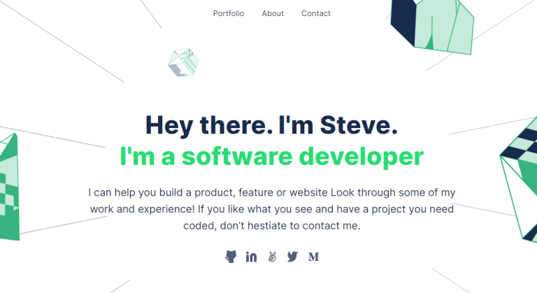

# Portfolio: Desktop Version

Portfolio ~ is a web-app that talks in details about my background in different
aspects of life, especially technical expertise and skills. Here you can read about any 
aspect of my like especially computer programming skills and all technologies I'm familiar with.
> The app normally runs across different devices like desktop & mobile devices.


## Built With

- html
- css
- JavaScript


## Live Demo

[Online Version Demo](https://sntakirutimana72.github.io/Portfolio-desktop-version/)


## Screenshots

### Homepage screenshot




## Getting Started

To get a copy of this project running on your local computer, do the followings:

### Prerequisites
  - Must have a working computer
  - A Web-Browser installed (Chrome - Recommended)

### Setup
  - Install _VSCode_ ([link](https://code.visualstudio.com/download))
  - Clone this project repository on your local computer. ([link](../../))
  - Open the project directory with _VSCode_

### Install
Open _Terminal/Shell_ inside your _VSCode_ and run
  ```
    npm install --force
  ```

### Run tests
  - For _hint_ tests, run
      ```
        npm run lint:hint
      ```
  - For _style_ tests, run
      ```
        npm run lint:style
      ```
  - For _eslint_ tests, run
      ```
        npm run lint:es
      ```


## Authors

👤 **Steve**

- GitHub: [@sntakirutimana72](../../../)

👤 **MOhammed Raad**

- GitHub: [@MoRaad97](https://github.com/MoRaad97)

## 🤝 Contributing

Contributions, issues, and feature requests are welcome!

Feel free to check the [issues page](../../issues/).

## Show your support

Give a ⭐️ if you like this project!

## Acknowledgments

- Fellow Micronauts
